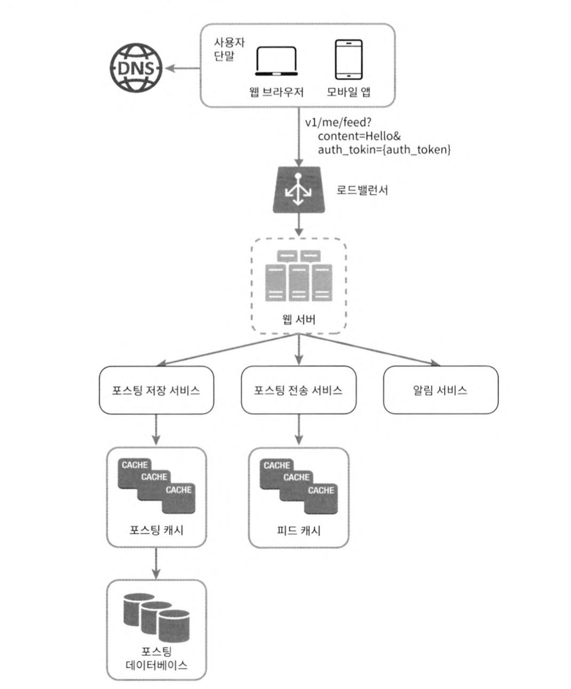
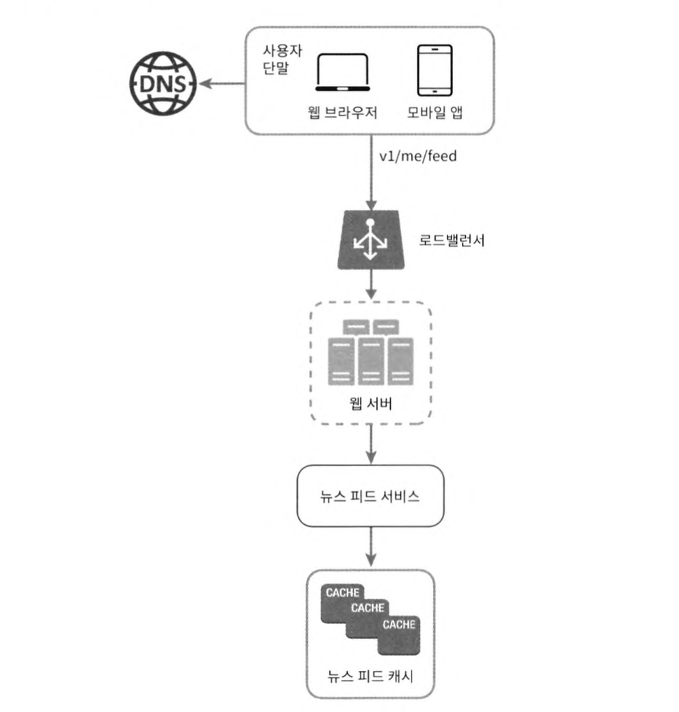
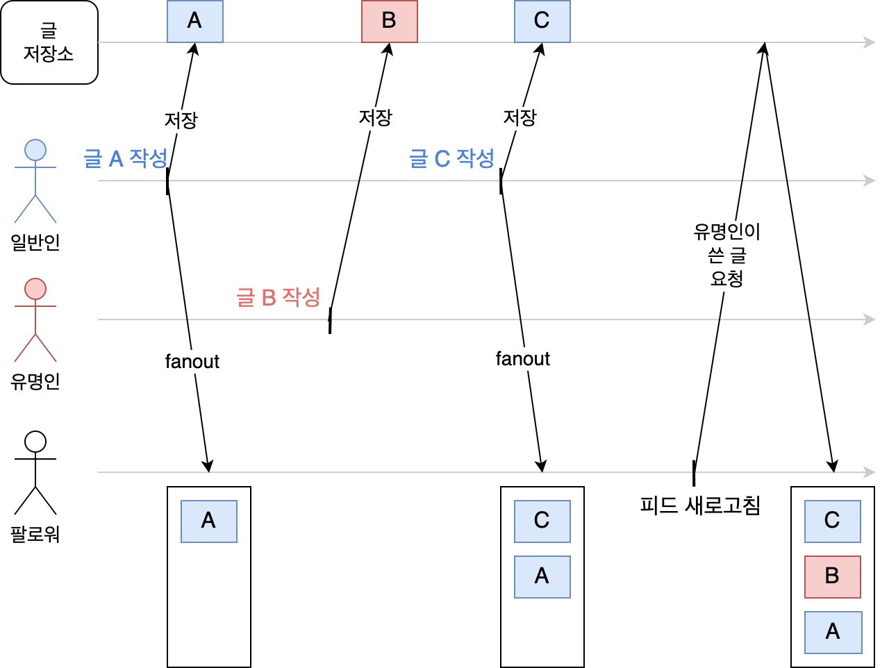
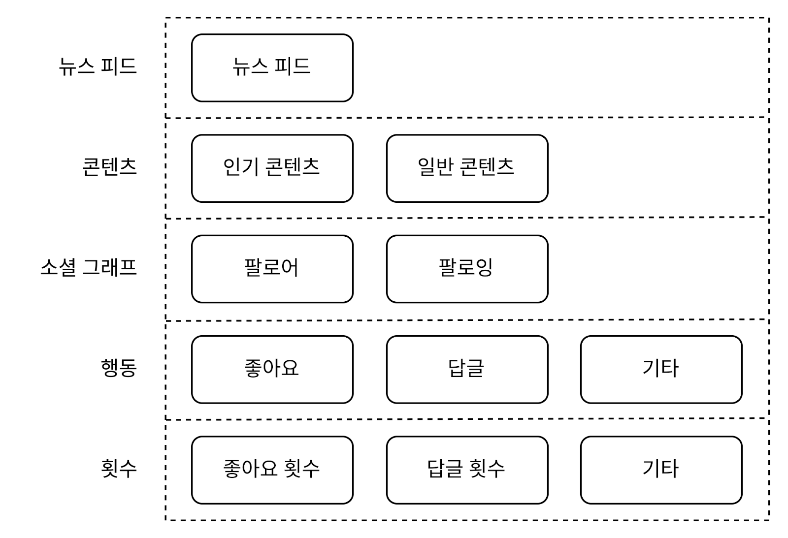

# 11장. 뉴스 피드 시스템 설계

아래의 요구사항을 만족시키는 뉴스 피드 시스템을 설계해보자.

- 모바일, 웹 모두 지원
- 사용자는 뉴스 피드 페이지에 포스트를 게시할 수 있어야 함
- 사용자는 친구들이 게시한 포스트를 볼 수 있어야 함
- 포스트는 단순 시간 흐름 역순으로 배치
- 이미지, 비디오 등의 미디어 파일이 포함될 수 있음

## 목차
- [개략적 설계안](#개략적-설계안)
- [피드 발행 플로우](#피드-발행-플로우)
- [뉴스 피드 생성 플로우](#뉴스-피드-생성-플로우)
- [캐시 구조](#캐시-구조)

## 개략적 설계안
이와 같은 시스템은 크게 **(1) 피드 발행(feed publishing)** 과 **(2) 뉴스 피드 생성(news feed building)** 파트로 나눌 수 있다.

 

|||
|-|-|
|
피드 발행
|
뉴스 피드 생성
|

### 피드 발행
사용자가 포스트를 게시하면 캐시 및 데이터베이스에 기록하고 친구의 뉴스 피드로 전송한다.

- 사용자 API: `POST /v1/me/feed`
- 포스팅 저장 서비스(post service): 새 포스트를 캐시와 데이터베이스에 저장
- 포스팅 전송 서비스(fanout service): 새 포스트를 친구의 피드로 푸시(push)
- 알림 서비스(notification service): 새 포스트를 올리면 친구들에게 푸시 알림을 전송

### 뉴스 피드 생성
사용자의 친구들이 게시한 포스트를 모아서 시간 흐름 역순으로 배치한다.

- 사용자 API: `GET /v1/me/feed`
- 뉴스 피드 서비스(news feed service): 캐시에서 뉴스 피드를 가져옴
- 뉴스 피드 캐시(news feed cache): 뉴스 피드에 필요한 피드의 ID를 보관

## 피드 발행 플로우

### 웹 서버
클라이언트의 요청을 처리할 때 인증 및 처리율 제한 기능도 수행해야 한다.

- 인증: API 요청 시 `Authorization` 헤더에 적절한 인증 토큰을 넣은 사용자만 포스팅할 수 있어야 함
- 처리율 제한: 스팸과 유해한 콘텐츠 업로드 방지를 위해 시간 당 올릴 수 있는 포스팅 수에 제한을 두어야 함

### 포스팅 전송 서비스
새 포스팅을 친구들에게 보내주는 팬아웃(fanout)에는 크게 **푸시(push)** 모델과 **풀(pull)** 모델이 있다.

**(1) 푸시 모델**
- 쓰기 시점에 팬아웃(fanout-on-write)
    - 새 포스트가 게시되는 시점에 뉴스 피드 갱신
- 특징
    - ➕ 뉴스 피드를 읽는 시점에는 이미 갱신되어 있으므로(pre-computed) 읽는 데 드는 시간 단축
    - ➖ 친구가 많은 사용자(hotkey)는 피드 갱신이 오래 걸림
    - ➖ 자주 들어오지 않는 사용자의 피드도 갱신해야 하므로 컴퓨팅 자원 낭비

**(2) 풀 모델**
- 읽기 시점에 팬아웃(fanout-on-read)
    - 사용자가 피드를 읽는 시점에 뉴스 피드 갱신
- 특징
    - ➕ 비활성된 사용자에 대해서는 컴퓨팅 자원을 소모하지 않음
    - ➕ 핫키 문제도 생기지 않음
    - ➖ 뉴스 피드를 읽는 데 많은 시간이 소요될 수 있음

두 방식의 단점은 버리고 장점만 취하기 위해 친구가 많은 사용자인 *핫키에 대해서는 풀 모델*을 사용하고 *일반적인 사용자에 대해서는 푸시 모델*을 사용하는 방식을 사용할 수 있다.

 

 
<!--  -->

푸시 모델을 사용하는 포스팅 전송(팬아웃) 서비스의 플로우는 다음과 같다.

1. 친구 ID 목록 추출
    - 그래프 데이터베이스에서 친구 ID 목록을 가져온다.
2. 친구 데이터 추출
    - 사용자 정보 캐시에서 친구들의 정보를 가져온다.
3. 메시지 큐
    - 친구 목록과 포스트 ID를 메시지 큐에 넣는다.
4. 뉴스 피드 갱신
    - 팬아웃 작업 서버가 메시지 큐에서 데이터를 꺼내서 뉴스 피드 캐시에 넣는다.
    - 뉴스 피드 캐시는 `<포스트 ID, 사용자 ID>` 쌍을 보관하는 매핑 테이블이라고 할 수 있다.
    - 캐시 크기에 적절한 수준의 제한을 둔다. 

## 뉴스 피드 생성 플로우
### CDN
이미지, 비디오와 같은 미디어 콘텐츠는 CDN에 저장하여 빠르게 읽을 수 있도록 한다.

### 뉴스 피드 서비스
뉴스 피드 서비스의 플로우는 다음과 같다.

1. 포스트 목록 가져오기
    - 뉴스 피드 캐시에서 포스트의 ID 목록을 가져온다.
2. 완전한 뉴스 피드 만들기
    - 포스트의 컨텐츠와 이미지 등을 포스트 캐시에서 가져온다.
    - 사용자의 이름과 사진을 사용자 캐시에서 가져온다.

## 캐시 구조
뉴스 피드 시스템의 핵심 컴포넌트는 캐시이다. 뉴스 피드 시스템에서는 캐시를 다음과 같은 다섯 계층으로 구성할 수 있다.

- 뉴스 피드: 뉴스 피드의 ID를 보관
- 콘텐츠: 포스트의 콘텐츠 데이터를 보관, 인기 콘텐츠는 따로 분리하여 보관
- 소셜 그래프: 사용자 간 관계 정보를 보관
- 행동(action): 좋아요, 댓글과 같은 포스트에 대한 사용자의 행동 정보를 보관
- 횟수(counter): 좋아요/댓글 수, 팔로워/팔로잉 수와 같은 정보를 보관