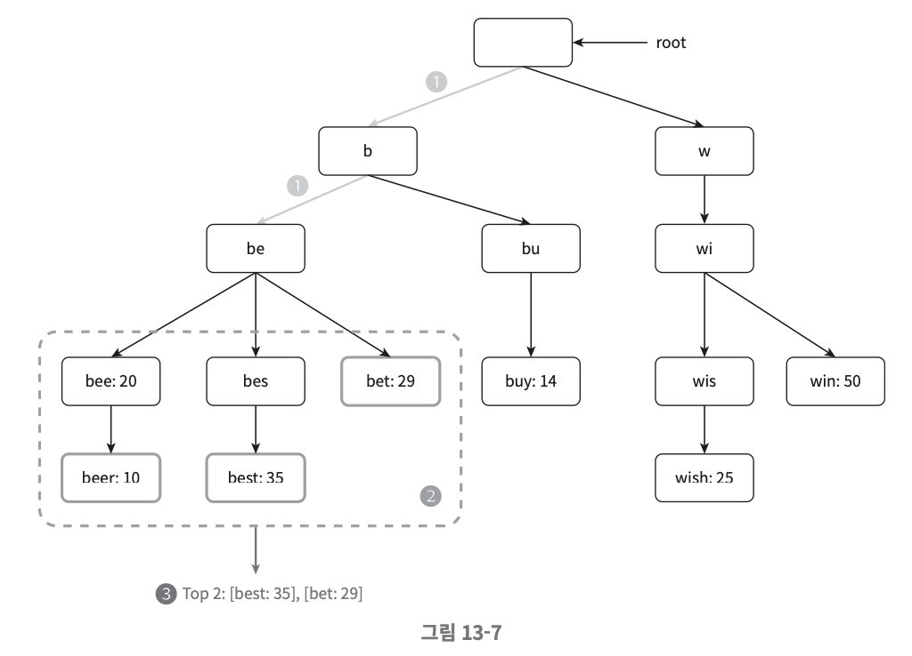
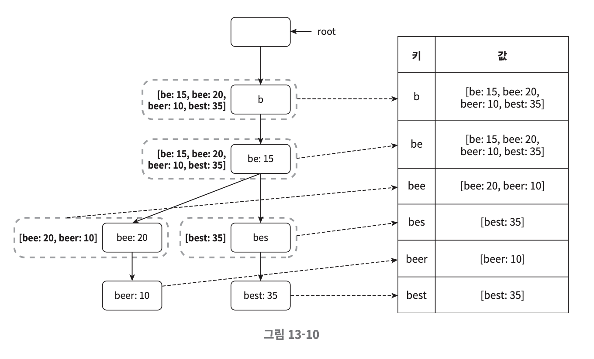

# 13장. 검색어 자동완성 시스템

아래의 요구사항을 만족시키는 검색어 자동완성 시스템을 설계해보자.

- 모든 쿼리는 알파벳 소문자로만 이루어짐
- 자동완성된 검색어는 사용자의 입력 단어와 연관된 것이어야 함
- 출력될 검색어는 인기도 등의 순위 모델에 의해 정렬되어 있어야 함
- 검색창에 글자를 하나 입력할 때마다 백엔드에 자동완성 요청을 보내야 함
```
╭─────────────────────────────╮ ╭────────╮
│ dinner                      │ │ Search │
╰─────────────────────────────╯ ╰────────╯

> `search?q=d`
> `search?q=di`
> `search?q=din`
> `search?q=dinn`
> `search?q=dinne`
> `search?q=dinner`
```

## 목차
- [개략적 설계안](#개략적-설계안)
- [트라이 자료구조](#트라이-자료구조)
- [데이터 수집 서비스](#데이터-수집-서비스-1)
- [질의 서비스](#질의-서비스-1)
- [트라이 연산](#트라이-연산)
- [저장소 규모 확장](#저장소-규모-확장)

## 개략적 설계안
검색어 자동완성 시스템은 사용자의 쿼리를 실시간으로 수집하는 **(1) 데이터 수집 서비스**와 사용자의 쿼리에 대한 인기 검색어를 정렬하여 반환하는 **(2) 질의 서비스**로 나뉜다.

### 데이터 수집 서비스
사용자들이 단어를 검색하면 그 단어의 검색 빈도를 수집, 저장하는 서비스이다. 편의상 아래와 같이 테이블 형태로 저장한다고 가정해보자. 사용자가 단어를 검색하면 테이블에서 해당 단어에 대한 빈도를 갱신한다.

<p align="center"></p>

### 질의 서비스
질의 서비스는 반대로 데이터 수집 서비스로부터 수집된 빈도를 사용하여 자동완성 검색어들을 반환하는 서비스이다. 만약 검색어 빈도를 테이블 형태로 저장했다면 다음과 같은 SQL 쿼리로 상위 5개의 자동완성 검색어를 반환할 수 있다.

<p align="center"></p>

```sql
SELECT * FROM frequency_table
WHERE query LIKE `tw%`
ORDER BY frequency DESC
LIMIT 5
```

## 트라이 자료구조
검색어 빈도를 테이블 형태로 RDB에 저장하여 SQL로 상위 5개의 자동완성 검색어를 질의하는 방식은 효율성이 떨이진다. 따라서 테이블 대신 트라이를 사용하여 검색어 빈도를 관리한다.

**트라이**(trie, prefrix tree)는 문자열 검색을 위한 탐색 트리 자료구조로, 모든 자식 노드는 *부모 노드를 접두어(prefix)로* 가지며 루트 노드는 빈 문자열을 나타낸다. 자동완성 시스템에서는 빈도에 따라 정렬된 결과를 내놓아야 하기 때문에 각 노드에 빈도 정보까지 같이 저장한다.

<p align="center"></p>

트라이에서 $k$개의 최빈 단어를 추출하는 과정을 간단하게 살펴보자. 가령 사용자가 `be`를 입력했다고 하자.

<p align="center"></p>

1. 해당 접두어를 나타내는 노드를 찾는다.
    - 접두어의 길이를 $p$라고 하면 시간 복잡도는 $O(p)$(해당 노드의 깊이)가 된다. 
    - 위 그림에서 $p = 2$이다.
2. 해당 노드를 루트로 갖는 하위 트리를 탐색하여 유효한 자식 노드들을 찾는다. 
    - 자식 노드의 개수를 $c$라고 하면 시간 복잡도는 $O(c)$이다. 
    - 위 그림에서 $c = 5$이다.
3. 유효 노드들의 빈도 값을 정렬하여 상위 $k$개를 반환한다. 
    - 시간 복잡도는 $O(c \log c)$이다.
    - 위 그림에서 $k = 2$이다.

따라서 총 시간 복잡도는 $O(p) + O(c) + O(c \log c)$이다. 이러한 알고리즘은 직관적이지만 최악의 경우 전체 트리를 모두 탐색해야할 수도 있다. 

- 접두어의 길이가 길어지면 $p$가 커져서 전체 시간 복잡도가 증가
- 접두어가 지나치게 짧으면 탐색해야 할 하위 트리의 노드 개수인 $c$가 커져서 전체 시간 복잡도가 증가

이를 방지하기 위해 **(1) 접두어의 최대 길이를 제한**하거나 **(2) 각 노드에 인기 검색어를 캐시**할 수 있다.

### 접두어 최대 길이 제한
사용자가 검색창에 긴 검색어를 입력하는 일은 드물기 때문에 $p$값을 작은 정수값으로 가정해도 안전한다. 그렇다면 접두어 노드 탐색의 시간 복잡도는 $O(p)$에서 $O(1)$로 바뀔 것이다.

### 노드에 인기 검색어 캐시
사용자의 검색어가 짧을수록 탐색해야 할 하위 트리의 크기가 기하급수적으로 커지게 된다. 이때 각 노드에 하위 트리의 인기 검색어를 캐시하면 자식 노드를 탐색하는 데 걸리는 시간 복잡도를 $O(1)$로 낮출 수 있다. 부가적인 저장 공간이 필요하게 된다는 단점이 있지만 빠른 응답 속도를 위해 희생할 만한 가치가 있다.

<p align="center"></p>

이렇게 접두어 최대 길이를 제한하고 각 노드에 하위 트리의 인기 검색어를 캐시하는 것을 통해 전체 시간 복잡도를 $O(1)$로 획기적으로 단축할 수 있다.

## 데이터 수집 서비스
사용자가 검색어를 입력할 때마다 실시간으로 빈도 데이터를 수정하는 방식은 그다지 효율적이지 않다.

- 매일 수천만 번씩 트라이를 갱신해야 함
- 하지만 인기 검색어는 자주 바뀌지 않으므로 트라이도 자주 갱신할 필요가 없음

그렇기 때문에 아래와 같이 데이터 수집 서비스를 설계해볼 수 있다.

<p align="center"></p>

### 데이터 분석 서비스 로그
사용자가 검색창에 입력한 쿼리에 대한 원본 데이터를 보관한다. 로그 데이터는 추가될 뿐 수정되지 않으며 인덱스를 걸지 않는다.

### 로그 취합 서버
시스템이 로그 데이터를 쉽게 소비할 수 있도록 잘 취합해야 한다. 트위터와 같은 실시간 애플리케이션에서는 데이터 취합 주기를 짧게 가져갈 수 있지만 대부분의 경우에는 일주일에 한 번 취합하는 정도로도 충분할 것이다.

### 취합된 데이터
로그 데이터는 로그 취합 서버에서 다음과 같은 형태로 변환된다. 

<p align="center"></p>

### 작업 서버
특정 주기마다 트라이 자료구조를 만들고 데이터베이스에 저장하는 비동기적 작업을 실행한다.

### 트라이 캐시
읽기 성능을 높이기 위해 매주 트라이 데이터베이스의 스냅샷을 떠서 갱신한다.

### 트라이 데이터베이스
트라이의 지속성을 위한 저장소이다. 문서 저장소(document store) 혹은 키-값 저장소를 고려해볼 수 있다.

- 문서 저장소: 매주 새 트라이를 만들것이기 때문에 주기적으로 트라이를 직렬화하여 몽고DB와 같은 저장소에 저장한다.
- 키-값 저장소: 트라이의 모든 접두어를 키, 해당 접두어 노드에 캐시한 인기 검색어를 값으로 저장한다.

<p align="center"></p>

## 질의 서비스
앞서 설계한 데이터 수집 서비스를 기반으로 다음과 같이 질의 서비스를 설계할 수 있다.

1. 쿼리를 로드 밸런서로 전송
2. 로드밸런서는 해당 쿼리를 API 서버로 전송
3. API 서버는 트라이 캐시에서 데이터를 가져옴
4. 캐시 미스 발생 시 트라이 데이터베이스에서 데이터를 가져옴

질의 서비스는 빠른 응답 시간이 핵심이기 때문에 결과를 사용자의 브라우저에 캐시에 넣어둘 수도 있다. 실제로 구글 검색 엔진이 이런 메커니즘을 사용한다고 한다.

## 트라이 연산
### 트라이 갱신
트라이는 검색어 자동완성 시스템의 핵심 컴포넌트다. 보통 트라이는 매주 한 번 갱신하며, 완전히 새로운 트라이를 생성하여 기존 것을 대체하는 방식을 사용한다. 각 노드를 개별적으로 갱신하는 방법을 채택하지 않는 이유는 성능이 좋지 않기 때문이다. 특정 노드의 빈도 값을 갱신하면 해당 노드의 모든 상위 노드또한 갱신해야 한다. 상위 노드, 즉 접두어 노드에는 인기 검색어 결과가 캐시되어 보관되어 있기 때문이다.

### 검색어 필터링

<p align="center"></p>

혐오성이 짙거나 폭력적인 검색어를 자동완성 결과에서 제거하기 위해 트라이 캐시 앞에 필터 계층(filter layer)를 둘 수 있다. 이렇게 별도의 계층을 두면 필터 규칙을 자유롭게 변경하면서 반환된 검색 결과를 통제할 수 있다. 부적절한 검색어를 데이터베이스에서 삭제하는 작업은 추후에 비동기적으로 진행하면 된다.

## 저장소 규모 확장
트라이의 크기가 단일 서버에 넣을 수 없을 정도로 커지면 여러 서버에 분할하여 저장해야 한다.

### 사전 순으로 샤딩
단순하게 생각하면 단어의 첫 글자를 기준으로 샤딩하는 방법을 생각해 볼 수 있다.

- 서버 2대: `a-m` / `n-z`
- 서버 3대: `a-i` / `j-r` / `s-z`

이렇게 하면 최대 26대의 서버로 분할할 수 있는데, 여기서 규모가 더 커지면 계층적으로 샤딩을 하면 된다. 가령 `a`로 시작하는 단어를 두 대의 서버로 나눠서 보관하고 싶다면 1번 서버에 `aa-am`, 2번 서버에 `an-az`로 시작하는 단어를 저장하면 된다.

### 검색어 대응 샤드 관리자

<p align="center"></p>

단어를 사전순으로 분할하면 당연히 불균형이 생길 수밖에 없다. 'c'로 시작하는 단어는 'x'로 시작하는 단어보다 월등히 많을 것이기 때문이다. 이를 해결하기 위해 검색어 대응 샤드 관리자(shard map manager)를 도입할 수 있다. 샤드 관리자는 어떤 검색어가 어떤 서버에 저장되어있는 지에 대한 정보를 관리한다. 