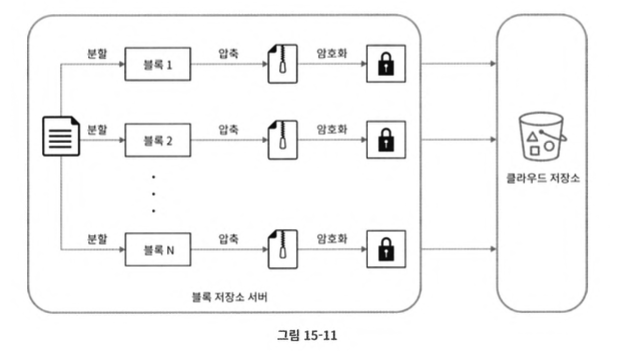

# 구글 드라이브 설계

## 구글 드라이브 서비스란?
- 파일 저장 및 동기화 서비스로, 문서, 사진, 비디오, 기타 파일을 클라우드에 보관할 수 있도록 함
- 이 파일은 컴퓨터, 스마트폰, 태블릿 등 어떤 단말에서도 이용 가능함.

## 1. 문제 이해 및 설계 범위 확장
> 앞서 설명된 모든 장과 똑같이, 설계 범위를 좁혀야 한다.

질문 리스트:
- 지원해야 할 기능들
- 지원하는 단말기
- 파일 암호화
- 파일 크기 제한
- 사용자 규모
- 등

이번 장에서의 예시:
- 기능:
    - 파일 업로드 / 다운로드, 파일 동기화, 알림
- 단말기:
    - 모바일 앱 + 웹 앱
- 파일 암화화:
    - Yes
- 파일 크기:
    - 10GB 제한
- 사용자:
    - 일간 능동 사용자(DAU) 기준으로 천만(10M)명


### 기능적 요구사항
이번 장에서 설계 논의할 것:
- 파일 추가, drag-and-drop (파일을 구글 드라이브 안으로 떨구는 가장 쉬운 방법)
- 파일 다운로드
- 여러 단말기 파일 동기화
- 파일 갱신 이력 조회 (revision history)
- 파일 공유
- 파일이 편집 OR 삭제 OR 새롭게 공유 되었을 시, 알림 표시

논의 하지 않을 것:
- 구글 문서 편집 및 협업 기능. (같은 문서를 여러 사용자들이 동시 편집할 수 있게 하는 기능)

### 비-기능적 요구사항
- 안정성:
    - 데이터 손실 문제
- 빠른 동기화 속도:
    - 시간이 오래 걸리면, 사용자들이 인내심을 잃고 떠남
- 네트워크 대역폭:
    - 네트워크 대역폭을 불필요하게 많이 소모하면, 사용자들이 싫어함
- 규모 확장성:
    - 아주 많은 양의 트랙픽도 처리 가능해야 함
- 높은 가용성:
    - 서버 장애, 느려짐, 네트워크 일부가 끊김 등 다양한 이슈에서도 시스템은 계속 사용 가능해야 함.

### 계략적 추정치
가정:
- 가입 사용자 = 50M, DAU 사용자 = 10M이 있음
- 모든 사용자에게 10GB의 무료 저장공간 할당
- 매일 각 사용자가 평균 크기가 500KB인 파일을 평균 2개를 업로드
- 읽기:쓰기 비율 1:1
- 필요 총 저장공간 = 50M user $\times$ 10GB = 500 Petabyte
- 업로드 API QPS = 10M user $\times$ 2회 업로드 / 24h / 3600s $\approx$ 240
- 최대 QPS = QPS $\times$ 2 = 480

## 2. 개략적 설계안 제시 및 동의 구하기
> 이번 장에서는 기존 장과 다르게, 한 대의 서버에서 출발해 점진적으로 천만 사용자 지원이 가능한 시스템으로 발전시켜 나갈 것이라고 한다.

### 서버 한대의 구성
- 웹 서버: 파일 업로드 및 다운로드하는 과정 처리
- 데이터 베이스: 사용자 데이터, 로그인 정보, 파일 정보 등의 메타데이터 보관
- 저장소 시스템: 파일 저장을 위해 1TB의 공간을 사용할 것


- 아파치 웹 서버 설치
- 데이터베이스 설치
- `drive/` 디렉토리 $\rightarrow$ 업로드 되는 파일 저장
- `namespace` 디렉토리 $\rightarrow$ 사용자 구분 (unique해짐)

`API`
3가지의 API가 필요하다.
- 파일 업로드 API
- 파일 다운로드 API
- 파일 갱신 히스토리 제공 API

1. 파일 업로드 API  
2 종류의 업로드를 지원:
    - 단순 업로드: 파일 크기가 작을 때 사용
    - 이어 올리기 (resumable upload): 파일 사이즈가 크고 네트워크 문제로 중단될 가능성이 높다고 생각될 때 사용

    이어 올리기 예시:
`https://api.example.com/files/upload?uploadType=resumable`

    인자:
    - uploadType=resumable
    - data: 업로드할 로컬 파일

    과정:
    - 이어 올리기 URL을 받기 위한 최소 요청 전송
    - 데이터를 업로드하고 업로드 상태 모니터링
    - 업로드 장애가 발생하면 장애 발생시점부터 업로드를 재시작

2. 파일 다운로드 API

    예시:
`https://api.example.com/files/download`

    인자:
    - path: 다운로드할 파일의 경로  
        - 예시:
        ```
            {
                "path": "/recipes/soup/best_soup.txt"
            }
        ```

3. 파일 갱싱 히스토리 API

    예시:  
    `https://api.example.com/files/download`

    인자:
    - path: 갱신 히스토리를 가져올 파일의 경로
    - limit: 히스토리 길이의 최대치

        - 예시:
        ```
        {
            "path": "/recipes/soup/best_soupt.txt",
            "limit": 20
        }
        ```

> 지금까지 나열된 모든 API는 사용자 인증을 필요로 하고 HTTPS 프로토콜을 사용해야 함.

> SSL (Secure Socket Layer)를 지원하는 프로토콜을 이용하는 이유는 클라이언트와 백엔드 서버가 주고받는 데이터를 보호하기 위한 것.

### 한 대 서버의 제약 극복
파일 시스템이 꽉 차면, 데이터를 sharding하여 여러 서버에 나누어 저장하여 문제를 해결할 수 있다.
- 데이터 손실 문제 완화

Sharding 예시:


S3서비스와 매우 유사:


그외:
- 로드밸런서
    - 네트워크 트래픽 분산
    - 특정 웹 서버 장애 발생 시, 자동으로 해당 서버를 우회
- 웹 서버
    - with 로드밸런서, 웹 서버 쉽게 추가 가능
    - with 로드 밸런서, 트래픽이 폭증해도 쉽게 대응 가능
- 메타데이터 데이터베이스
    - 데이터베이스를 파일 저장 서버에서 분리하여 SPOF(Single Point of Failure)를 회피.
    - 다중화 및 샤딩 정책을 적용하여 가용성과 규모 확장성 요구사항 대응
- 파일 저장소
    - S3 + 두 개 이상의 지역에 데이터를 다중화.

  
여러 대 서버로 분리 완료!

### 동기화 충돌
전략 1:
- 먼저 처리되는 변경은 성공, 나중에 처리되는 변경은 충돌이 발생하는 것으로 표시.
    - 충돌 발생 시, 두 파일을 하나로 합침 OR 둘 중 하나를 다른 파일로 대체


### 개략적 설계안


사용자 단말:
- 사용자가 이용하는 웹 브라우저, 모바일 앱 등의 클라이언트.

블록 저장소 서버 (block server):
- 파일 블록을 클라우드 저장소에 업로드하는 서버
- 파일을 여러 개의 블록으로 나눠 저장하며, 각 블록에는 고유한 해시값이 할당됨
    - 해시값은 메타데이터 데이터베이스에 저장됨
- 각 블록은 독립적인 객체로 취급되며 클라우드 저장소 시스템 (예: S3)에 보관
- 재구성 시, 블록들을 원래 순서대로 재조립해야됨.

클라우드 저장소:
- 파일 블록을 저장하는 용도

아카이빙 저장소 (cold storage):
- 비활성(inactive, 오랫동안 사용하지 않은) 데이터를 저장하기 위한 컴퓨터 시스템

로드밸런서:
- 요청을 모든 API 서버에 고르게 분산하는 역할

API 서버:
- 파일 업로드 외에 모든 것을 담당하는 서버
- 사용자 인증, 사용자 프로파일 관리, 파일 메타데이터 갱신 등...

메타데이터 데이터베이스:
- 사용자, 파일, 블록, 버전 등의 메타데이터 정보를 관리
> 실제 파일은 클라우드, 메타데이터 데이터베이스는 오직 메타데이터

메타데이터 캐시:
- 메타데이터 캐싱하는 용도

알림 서비스:
- 파일이 추가, 편집, 삭제되었음을 알려, 파일의 최신 상태를 확인하도록 도움

오프라인 사용자 백업 큐 (offline backup queue):
- 클라이언트가 오프라인 상태일 때, 업데이트 된 정보를 큐에 두어, 나중에 클라이언트가 온라인일 때 동기화할 수 있도록 돕는다.

## 3. 상세 설계
### 블록 저장소 서버
- 큰 파일들이 업데이트 될 때마다, 전체 파일을 서버로 보내면 네트워크 대역폭을 많이 잡아 먹는다.
- 블록 저장소 서버는 파일 업로드와 관련된 힘든 일을 처리하는 컴포넌트.

해결:
- 델타 동기화 (delta sync): 수정이 일어난 블록만 동기화
    
- 압축 (compression): 블록 단위로 압축. 압축 알고리즘은 파일 유형에 따라 다름. (예: 테스트 파일 $\rightarrow$ gzip, bzip2)



- 주어진 파일을 작은 블록들로 분할
- 각 블록을 압축
- 클라우드 저장소로 보내기 전에 암호화
- 크라우드 저장소로 전송

### 높은 일관성 요구사항
- 강한 일관성(strong consistency)이 필요
    - 같은 파일이 다른 단말 및 사용자에게 똑같이 보여야 함
- 메타데이터 캐시와 데이터베이스 계층에도 높은 일관성이 필요

`메모리 캐시`
- 결과적 일관성 (eventual consistency) 모델을 지원하는데,
    - 캐시에 보관된 사본과 데이터베이스에 있는 원본(master)이 일치
    - 데이터베이스에 보관된 원본에 변경이 발생하면 캐시에 있는 사본을 무효화

    를 보장하여 강한 일관성을 달성해야 한다.

`데이터베이스`
- 관계형 데이터베이스는 ACID를 보장하므로 강한 일관성이 쉬움
- NOSQL 데이터베이스는 동기화 로직 안에 프로그램해 넣어햐 함.

### 메타데이터 데이터베이스
스키마 예시:


### 업로드 절차

상황:
2개의 요청이 병렬적으로 전송됨 (전부 클라이언트 1이 보냄)
- 1st 요청: 파일 메타데이터를 추가하기 위한 것
- 2nd 요청: 파일을 클라우드 저장소로 업로드하기 위한 것


파일 메타데이터 추가:
1. 클라이언트 1이 새 파일의 메타데이터를 추가하기 위한 요청 전송
2. 새 파일의 메타데이터를 데이터베이스에 저장하고 업로드 상태를 대기중(pending)으로 변경
3. 새 파일이 추가되었음을 알림 서비스에 통지
4. 알림 서비스는 관련된 클라이언트(클라이언트 2)에게 파일이 업로드되고 있음을 알림

파일을 클라우드 저장소에 업로드:
1. 클라이언트 1이 파일을 블록 저장소 서버에 업로드
2. 블록 저장소 서버는 파일을 블록 단위로 쪼갠 다음 압축하고 암호화 한 다음에 클라우드 저장소에 전송
3. 업로드가 끝나면 클라우드 스토리지는 완료 콜백(callback)을 호출. 이 콜백 호출은 API 서버로 전송됨
4. 메타데이터 DB에 기록된 해당 파일의 상태를 완료(Uploaclecl)로 변경
5. 알림 서비스에 파일 업로드가 끝났음을 통지
6. 알림 서비스는 관련된 클라이언트(클라이언트 2)에게 파일 업로드가 끝났음을 알림

>파일 수정하는 경우에도 흐름은 비슷

### 다운로드 절차
파일 다운로드는 파일이 새로 추가되거나 편집되면 자동으로 시작.  
그럼 감지는?
1. 클라이언트 A가 접속 중이고 다른 클라이언트가 파일을 변경하면 알림 서비스가 클라이언트 A에게 변경이 발생했으니 새 버전을 끌어가야 한다고 알림

2. 클라이언트 A가 네트워크에 연결된 상태가 아닐 경우에는 데이터는 캐시에 보관될 것이다. 해당 클라이언트의 상태가 접속 중으로 바뀌면 그때 해당 클라이언트는 새 버전을 가져감


1. 알림 서비스가 클라이언트 2에게 누군가 파일을 변경했음을 알림
2. 알림을 확인한 클라이언트 2는 새로운 메타데이터를 요청
3. API 서버는 메타데이터 데이터베이스에게 새 메타데이터 요청
4. API 서버에게 새 메타데이터가 반환됨
5. 클라이언트 2에게 새 메타데이터가 반환됨
6. 클라이언트 2는 새 메타데이터를 받는 즉시 블록 다운로드 요청 전송
7. 블록 저 장소 서 버는 클라우드 저장소에서 블록 다운로드
8. 클라우드 저장소는 블록 서 버 에 요청 된 블록 반환
9. 블록 저장소 서버는 클라이언트에게 요청된 블록 반환. 클라이언트 2는 전
송된 블록을 사용하여 파일 재구성

### 알림 서비스
- 파일 수정되었음을 클라이언트에게 알려 충돌 가능성을 줄여야 함
- 이벤트 데이터를 클라이언트들로 보내는 서비스로 간주 가능

- 롱 폴링(long polling): 드롭박스가 이 방식을 채택하고 있음
- 웹소켓(W바?Socket): 클라이언트와 서버 사이에 지속적인 통신 채널을 제공, 양방향 통신이 가능

이 예시에서는 롱 풀링 사용:
- 알림 서비스의 양방향 통신이 필요 X
    - 서버의 변경 사항을 클라이언테에게만 알려주면 됨
- 알림을 보낼 일이 많지 않으며, 많은 양의 알림을 보낼 일도 없다.

### 저장소 공간 절약
안정성을 보장하기 위해, 여러 버전을 여러 데이터센터에 보관할 필요가 있다.
- 단, 자주 백업하면 저장용량이 빨리 소진됨.
- 중복 제거(de-dupe)
    - 해시값 비교하여 판단
- 지능적 백업 전략
    - 한도 설정: 상한 개수를 넘기면 오래된 버전을 버림
    - 중요한 버전만 관리

- 자주 쓰이지 않는 데이터는 아카이빙 저장소로 옮김

### 장애 처리
- 로드밸런서 장애
    - secondary 로드밸런서 활성화
    - heartbeat 신호로 주기적으로 상태를 모니터링
- 블록 저장소
    - 다른 서버가 미완료 상태 OR 대기 상태인 작업을 이어받음
- 클라우드 저장소 서버 장애
    - 예: S3는 여러 지역에 다중화 $\rightarrow$ 다른 지역에서 가져오면 됨
- API 서버 장애
    - stateless server
    - 로드밸런서는 API 서버 장애가 있는 서버로 트랙을 보내지 않으면 알아서 격리됨
- 메타데이터 캐시 장애
    - 다중화하는데, 한 노드에 장애 발생 시 다른 노드에서 데이터를 가져옴
    - 장애가 발생한 서버는 새 서버로 교체
- 메타데이터 데이터베이스 장애
    - 주 데이터베이스 서버 장애: 주 데이터베이스 서버 $\rightarrow$ 부 데이터베이스 서버, 부 데이터베이스 서버 $\rightarrow$ 새 서버
    - 부 데이터베이스 서버 장애: 다른 부 데이터베이스 서버가 읽기 연산 처리, 장애 서버는 새 것으로 교체
- 알림 서비스 장애:
    - 접속 중인 모든 사용자는 알림 서버와 롤 폴링 연결을 하나씩 유지함. (매우 많음)
    - 서버 장애 발생 시, 하나씩 다시 연결 시켜주어야 한다 $\rightarrow$ 매우 느림
- 오프라인 사용자 백업 큐 장애:
    - 다중화
    - 큐에 장애 발생 시, 구독 중인 클라이언트들은 백업 큐로 구독 관계를 재설정해주어야 함.
