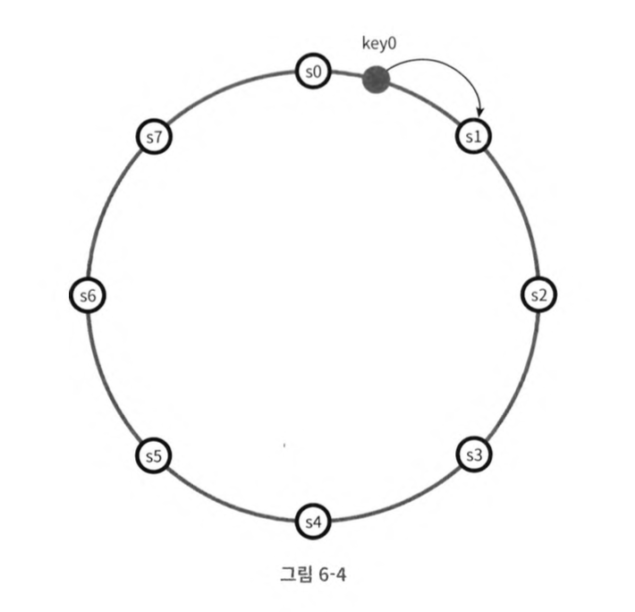
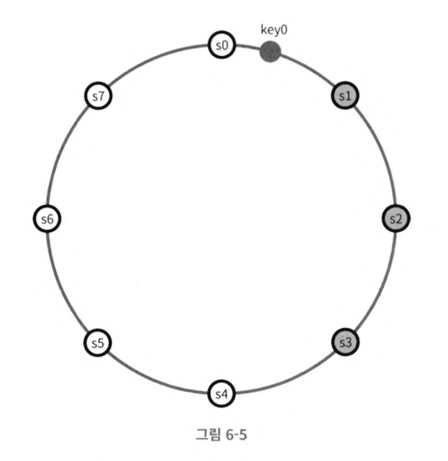
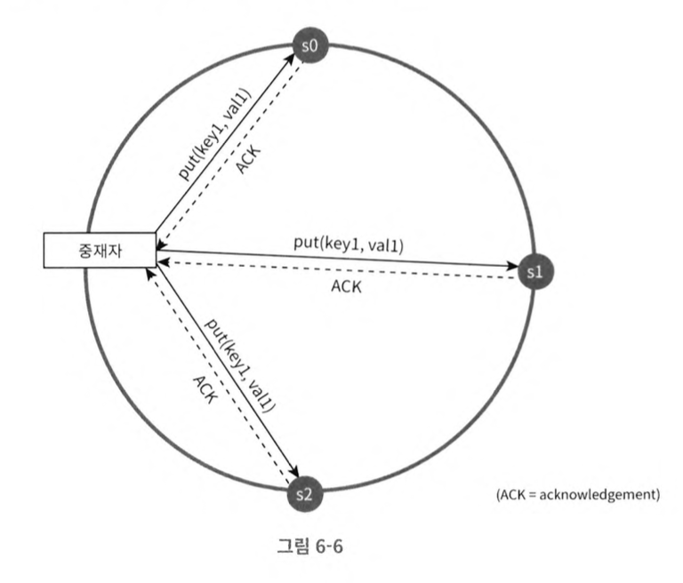
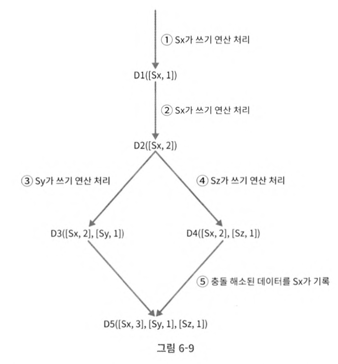
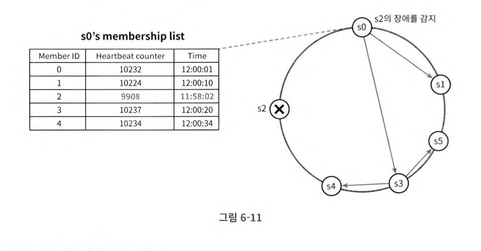

## 6장. 키-값 저장소 설계

- [키-값 저장소](#키-값-저장소)
- [단일 시스템 vs. 분산 시스템](#단일-시스템-vs-분산-시스템)
- [시스템 컴포넌트](#시스템-컴포넌트)

## 키-값 저장소

키-값 저장소(key-value store)는 값(value)이 고유 식별자인 키(key)와 쌍을 이루어 저장되는 형태의 비 관계형 데이터베이스이다.

- *키는 유일해야 한다*. 값은 키를 통해서만 접근할 수 있기 때문이다.
- 값은 어떤 형태로든 올 수 있다.

높은 가용성과 확장성을 제공하고, 데이터 일관성 수준을 조정할 수 있는 키-값 저장소를 설계해보자.

## **단일 시스템 vs. 분산 시스템**

단일 키-값 저장소는 모든 키-값 쌍을 메모리에 해시 테이블로 저장하는 방식으로 구현할 수 있다.
- 설계가 간단하지만, 한 대의 서버만으로는 부족해지는 때가 온다.

분산 키-값 저장소를 설계할 때에는 CAP를 고려하여야 한다.

> **CAP 정리**
> 
> 분산 시스템은 일관성(consistency), 가용성(availability), 파티션 감내(partition tolerance) 세 가지 요구사항을 동시에 충족시킬 수 없다는 정리이다.
> - *일관성*: 모든 노드가 동일한 데이터를 반환해야 한다.
> - *가용성*: 일부 노드에 장애가 발생해도 클라이언트는 응답을 받을 수 있어야 한다.
> - *파티션 감내*: 노드 사이에 네트워크 장애가 발생하여 파티션이 생기더라도 시스템은 계속 동작해야 한다.

- CP 시스템
    - 가용성(A)을 포기한다. 
    - 특정 노드가 죽으면 데이터 일관성을 위해 쓰기 연산을 중단시킨다.
- AP 시스템 
    - 일관성(C)을 포기한다. 
    - 특정 노드가 죽어도 읽기 및 쓰기 연산을 허용한다.
- CA 시스템
    - 네트워크 장애는 피할 수 없으므로 실세계에 존재하지 않는다.

요구사항에 따라 CP 시스템과 AP 시스템 중 더 적절한 쪽을 채택한다.
- e.g. 은행권 시스템에서는 일관성을 양보할 수 없으므로 CP 시스템으로 설계한다.

## 시스템 컴포넌트

키-값 저장소 구현에 필요한 구성 요소들을 살펴보자.

**(1) 데이터 파티션**

데이터를 작은 파티션으로 분할하여 여러 대의 서버에 나눠서 저장해야 한다.
- 데이터를 어떻게 *"고르게"* 분산시킬 것인가
- 노드 추가, 삭제 시 어떻게 *"데이터 이동을 최소화"* 할 것인가

→ 안정 해시를 사용한다.

**(2) 데이터 다중화**

안정성과 가용성을 위해 동일한 데이터를 여러 서버에 다중화(replicate)하여 저장해야 한다.
- 키를 해시 링 위에 배치하여 순회시켰을 때 만나는 첫 $\text{N}$개의 서버에 데이터를 저장한다.
- 안정성을 위해 데이터를 별개의 *물리 서버*에 저장해야 한다.
    - 동일한 물리 서버에 위치한 가상 노드들에 저장하면 안정성 확보가 불가능하다.

**(3) 데이터 일관성**

다중화된 데이터끼리는 적절하게 동기화가 이루어져야 한다. 정해진 개수의 서버로부터 응답을 받아서 읽기/쓰기 연산의 성공 여부를 판단하는 *정족수 합의(Quorum consensus)* 프로토콜을 사용한다.
- $\text{N}$: 총 사본의 개수
- $\text{W}$: 쓰기 연산의 정족 수. $\text{W}$개의 ACK 응답을 받으면 쓰기 연산 성공으로 간주.
- $\text{R}$: 읽기 연산의 정족 수. $\text{R}$개의 응답을 받으면 읽기 연산 성공으로 간주.

$\text{W}$와 $\text{R}$의 값을 조정하여 일관성 수준을 결정할 수 있다.
- $\text{W} + \text{R} \gt \text{N}$: 강한 일관성을 보장.
- $\text{W} + \text{R} \leq \text{N}$: 강한 일관성이 보장되지 않음. 약한 일관성 혹은 결과적 일관성을 보장.

**(4) 일관성 불일치 해소**

데이터를 다중화하면 사본 간 일관성이 깨질 수도 있다. 비일관성은 벡터 시계(vector clock)를 활용한 데이터 버저닝을 통해 해소할 수 있다.

- 데이터를 변경할 때마다 기록한 서버 $\text{S}_i$와 버전 카운터 $\text{v}_j$를 기록한다.
- 

**(5) 장애 처리**

가십 프로토콜(gossip protocol)을 사용하면 분산 시스템의 장애를 감지할 수 있다.
- 각 노드는 주기적으로 자신의 박동(heartbeat) 카운터를 기록한다.
- 각 노드는 다른 노드들의 박동 카운터 목록을 유지한다.
- 주기적으로 무작위 노드에 자신이 가지고 있는 목록을 보낸다.
- 목록을 받은 노드는 그 목록을 보고 자신이 가지고 있는 목록을 갱신한다.
- 박동 카운터 값이 오랫동안 갱신되지 않은 노드를 장애 상태로 간주한다.

노드들의 박동 카운터 값이 마치 가십처럼 퍼져나간다.

장애가 발생하면 다음과 같이 처리한다.
- 일시적 장애: 다른 서버가 일시적으로 읽기/쓰기 작업을 처리하고 변경사항을 전달하여 일관성을 유지한다.
- 영구적 장애: 머클 트리를 사용하여 불일치 사항들을 확인하고 동기화한다.
