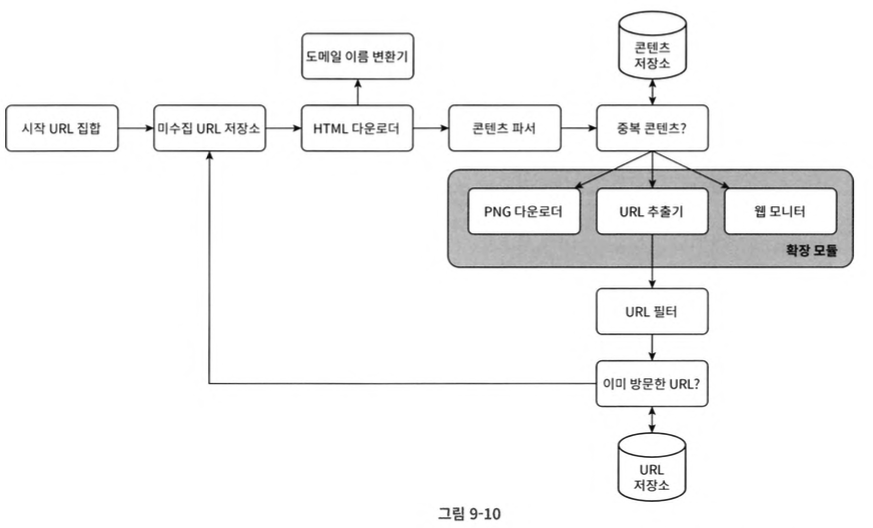

# CH9. 웹 크롤러 설계

태그: 가상 면접 사례로 배우는 대규모 시스템 설계 기초

# 웹 크롤러?

`web crawler` = `robot` = `spider`

> 검색 엔진에서 널리 쓰는 기술로, 웹에 새로 올라오거나 갱신된 콘텐츠를 찾아내는 것.
> 
- 몇 개의 웹 페이지에서 시작하여, 링크를 따라 나가면서, 새로운 콘텐츠 수집
    
    
    

<aside>
💡 콘텐츠?
    
- 웹 페이지 
- 이미지 
- 비디오 
- pdf 파일

</aside>

사용 사례:

- `search engine indexing`
    - 웹 페이지를 모아 검색 엔진을 위한 local index 생성
    - 예: google 검색 엔진
- `web archiving`
    - 나중에 사용할 목적으로 장기보관하기 위해 웹에서 정보를 모으는 절차
    - 예: 미국 국회 도서관 (US Library of Congress)의 EU 웹 아카이브
- `web mining`
    - 인터넷에서 유용한 지식을 도출해 내는 것
    - 예: 금융 기업에서 주주 총회 자료나 연차 보고서 (annual report)를 다운받아 기업의 핵십 사업 방향 알아내기
- `web monitoring`
    - 인터넷에서 저작권이나 상표권이 침해되는 사례를 모니터링
    - 예: 디지마크 (Digimarc)는 웹 크롤러를 사용해 해적판 저작물을 찾아서 보고

복잡도:

데이터의 규모에 따라 달라진다.

- 간단한 프로젝트 ~ 초대형 프로젝트

> 따라서, 우선 우리가 설계할 웹 크롤러가 감당해야 하는 데이터의 규모와 기능들을 알아내야 한다.
> 

# 웹 크롤러 설계 단계

## 1. 문제 이해 및 설계 범위 확장

`웹 크롤러의 기본 알고리즘`

```
1. URL 집합이 입력으로 주어지면, 해당 URL들이 가리키는 모든 웹페이지를 다운
2. 다운받은 웹 페이지에서 URL들을 추출
3. 추출된 URL들을 다운로드할 URL 목록에 추가

위 3 단계를 반복
```

`면접 예시`

설계를 진행하기 전, 지원자가 면접관한테 질문을 던져서 요구사항을 알아내고 “설계 범위를 좁혀야 한다”.

예:

- 크롤러의 주된 용도는?
- 수집할 웹 페이지의 양 / 규모?
- 새로 생성된 웹 페이지 및 수정된 웹 페이지도 고려해야 하는지?
- 수집한 웹 페이지를 저장해야 하는지? 저장한다면 얼마동안 저장할 것이지?
- 중복된 콘텐츠는 어떻게 처리할 것인지?
- 등

**!면접관의 요구사항을 명확하게 파악하고 충족시키는게 포인트!**

좋은 웹 크롤러가 만족시켜야 할 `속성`들:

- `규모 확장성`
    - 병행성 (parallelism)을 활용하요 효과적으로 웹 크롤링
- `안정성 (robustness)`
    - 비정상적 입력이나 환경에 잘 대응할 수 있어야 한다.
        - 잘못 작성된 HTML, 아무 반응이 없는 서버, 장애, 악성 코드가 붙어 있는 링크 등.
- `예절 (politeness)`
    - 수집 대상 웹 사이트에 짧은 시간 동안 너무 많은 요청을 보내서는 안됨
- `확장성 (extensibility)`
    - 새로운 형태의 콘텐츠 지원

면접관의 요구사항 + 좋은 웹 크롤러의 속성들을 모두 고려하여

- 문제를 잘 이해하고,
- 설계 범위를 확정

책에서 나온 예시:


## 2. 개략적 설계안 제시 및 동의 구하기

설계안 예시:


작업 흐름 (work flow)은 다음과 같다:

1. 시작 URL들을 미수집 URL 저장소에 저장
2. HTML 다운로더는 미수집 URL 저장소에서 URL 목록을 가져온다
3. HTML 다운로더는 도메인 이름 변화기를 사용하여 URL의 IP 주소를 알아내고, 해당 IP주소로 접속하여 웹 페이지 다운
4. 콘텐츠 파서는 다운된 HTML 페이지를 파싱하여 올바른 형식을 갖춘 페이지인지 검증
5. 콘텐츠 파싱과 검증이 끝나면 중복 콘텐츠인지 확인하는 절차를 개시한다
6. 중복 콘텐츠인지 확인하기 위해, 해당 페이지가 저장소에 있는지 확인
    1. 저장소에 있을 경우 → 처리하지 않고 버린다
    2. 저장소에 없을 경우 → 저장소에 저장한 뒤, URL 추출기로 전달
7. URL 추출기는 해당 HTML 페이지에서 링크를 골라낸다.
8. 골라낸 링크를 URL 필터로 전달
9. 필터링이 끝나고 남은 URL만 중복 URL 판별 단계로 전달
10. 이미 처리한 URL인지 확인하기 위하여, URL 저장소에 보관된 URL인기 검사
    1. 저장소에 있을 경우 → URL 버린다.
11. 저장소에 없는 URL은 URL 저장소에 저장 + 미수집 저장소에 전달

각 요소들이 무엇인지 살펴보자:

`시작 URL 집합`

- 크롤링을 시작하는 출발점
- **크롤러가 가능한 많은 링크를 탐색할 수 있도록 하는 URL을 고르는 것이 목표**
- 일반적으로 전체 URL 공간을 작은 부분집합으로 나누는 전략을 쓴다
    - 지역적인 특색
        - 나라별 인기 웹 사이트
    - 주제별로 다른 시작 URL
        - URL 공간을 쇼핑, 스포트, 건강 등으로 세분화

> 시작 URL로 무엇을 쓸 것이냐는 질문에 정답은 없다.
면접관도 완벽한 답안을 기대하는 것이 아니니, 의도가 무엇인지만 정확히 전달하도록 하자.
> 

`미수집 URL 저장소`

2가지의 크롤링 상태:

- 다운로드 할 URL → 저장 관리하는 컴포넌트를 미수집 URL 저장소 (URL frontier)라고 부름 (FIFO queue)
- 다운로드 된 URL

로 나뉘어 관리한다.

`HTML 다운로더`

- 인터넷에서 웹 페이지를 다운로드하는 컴포넌트.
- 다운로드 할 페이지의 URL은 미수집 URL 저장소가 제공

`도메인 이름 변환기`

- URL에 대응되는 IP 주소를 알아낸다.

`콘텐츠 파서`

- 파싱 (parsing)과 검증 (validation)
    - 이상한 웹 페이지는 문제를 일으키고, 저장 공간 낭비하기 때문
- 독립된 컴포넌트로 만든 이유:
    - 서버 안에 콘텐츠 파서를 구현하면 크롤링 과정이 느려짐

`중복 콘텐츠`

- 두 문서를 문자열로 비교하여 중복 확인 → 느리고 비효율
- 웹 페이지의 해시 값 비교 → 비교적 효과적

`코텐츠 저장소`

- HTML 문서를 보관하는 시스템
- 저장할 데이터의 유형, 저장소 접근 빈도, 데이터의 유효 기간등을 종합적으로 고려하여 저장소를 구현하는 데 쓰일 기술을 골라야 한다.
    - 예: 데이터 양 $\uparrow$, 대부분의 콘텐츠를 디스크에 저장
    - 예: 인기 있는 콘텐츠 → 메모리에 저장, 지연 시간 $\downarrow$

`URL 추출기`

- HTML 페이지를 파싱하여 링크들을 골라내는 역할
    - 예: 상대 경로 → 절대 경로로 변환

`URL 필터`

- 특정 콘텐츠 타입, 파일 확장자를 갖는 URL, 접속 시 오류가 발생하는 URL, 접근 제외 목록 (deny list)에 포함된 URL 등을 크롤링 대상에서 배제하는 역할

`이미 방문한 URL`

- 이미 방문한 URL 처리 안하면 발생할 수 있는 문제: 서버 부하 $\uparrow$, 무한 루프
- 자료 구조: 블룸 필터 (bloom filter) / 해시 테이블

`URL 저장소`

- 이미 방문한 URL을 보관하는 저장소

## 3. 상세 설계

`DFS vs BFS`

- 페이지 = 노드
- 하이퍼링크 = 엣지

DFS의 문제점:

- 그래프 크기가 크면, 깊이를 가능하기가 어려워짐

BFS의 문제점:

- 예의 없는 (impolite) 크롤러
    - 한 페이지에서 추출한 링크들이 대부분 같은 서버로 연결되면, 크롤러는 동일한 호스트에 집중적으로 요청을 보내게 됨
    
    
    
- 우선순위의 부재
    - 모든 웹 페이지가 같은 수준의 품질, 중요성을 갖지 않다.
    - 페이지 순위 (page rank), 사용자 트래픽의 양, 업데이트 빈도 등 여러가지 척도에 비추어 우선순위를 구별하는 것이 맞다.

`미수집 URL 저장소`

- 미수집 URL 저장소를 잘 구현하는 것만으로도, 예의 (politeness), 우선순위, 신선도(feshness)를 구별하는 크롤러를 구현할 수 있다.
- **Politeness**
    - 문제점:
        - 짧은 시간에 많은 요청은 Dos(Denial-of-Service) 공격으로 간주되기도 한다.
        - 웹 사이트를 마비시킬 수도 있다.
    - 해결: hostname과 다운로드를 하는 작업 (worker thread) 사이의 관계를 유지함으로서
        - 동일 웹 사이트에 대해서는 한 번에 한 페이지만 요청해야하는 것이 바람직
        - 같은 웹 사이트의 페이지를 다운받는 태스크는 시간차를 두고 실행
        - 즉, 각 웹사이트에 대해 하나의 작업 스레드를 할당하고, 각 스레드는 자신에게 할당된 호스트명에 해당하는 URL들을 FIFO큐에 저장하며, 큐에 들어온 URL들을 순차적으로 처리. (한 번에 한 페이지 조건)
    - 예시:
    
    
    
     `큐 라우터 (queue router)`
    
    - 같은 호스트에 속한 URL은 언제나 같은 큐 (b1, b2, …, bn)으로 가도록 보장하는 역할
    
    `매핑 테이블 (mapping table)`
    
    
    
    - 호스트 이름과 큐 사이의 관계를 보관하는 테이블
    
    `FIFO 큐 (b1 ~ bn)`
    
    - 같은 호스트에 속한 URL은 언제나 같은 큐에 보관
    
    `큐 선택기 (queue selector)`
    
    - 큐들을 순회하면서 큐에서 URL을 꺼내서 해당 큐에서 나온 URL을 다운로드하도록 지정된 작업 스레드에 전달하는 역할
    
    `작업 스레드 (worker thrad)`
    
    - 전달된 URL을 다운로드하는 작업을 수행
        - 작업들 사이에는 일정한 delay를 둘 수 있다.

- **우선 순위**
    - 페이지랭크 (PageRank), 트래픽 양, 갱신 빈도 (update frequency) 등 다야안 척도를 사용하여 웹 페이지 간의 우선순위 구분
    - 설계:
        
        
        
        `순위결정장치 (prioritizer)`
        
        - URL을 입력으로 받아 우선순위 계산
        
        `큐 (f1, ..., fn)`
        
        - 우선순위별로 큐가 하나씩 할당
        - 우선순위가 높으면 선택될 확률 $\uparrow$
        
        `큐 선택기`
        
        - 임의 큐에서 처리할 URL을 꺼내는 역할을 담당
        - 순위가 높을수록 자주 꺼냄
        
        `전면 큐 (front queue)`
        
        - 우선순위 결정 과정을 처리
        
        `후면 큐 (back queue)`
        
        - 크롤러가 예의 바르게 동작하도록 보증

- 신선도
- 웹 페이지는 수시로 추가, 삭제, 변경 됨 → 데이터의 신선도를 위해 이미 다운로드한 페이지라도 주기적으로 재수집 (recrawl) 해줘야 함.
    - 많은 시간과 자원이 필요 → 최적화를 위해서:
        - 웹 페이지의 변경 이력 (update history) 활용
        - 우선순위를 활용하여, 중요한 페이지는 좀 더 자주 재수집

`미수집 URL 저장소를 위한 지속성 저장장치`

문제:

- 메모리 → 안정성, 규모 확정성 측면에서 바람직 하지 않다.
- 디스크 → 병목

해결:

- 절충안 (hybrid approach)
    - 대부분의 URL은 디스크
    - IO 비용을 줄이기 위해 메모리 버퍼에 큐를 둠 → 버퍼에 있는 데이터는 주기적으로 디스크에 기록

## HTML 다운로더

HTTP 프로토콜을 통해 웹 페이지를 내려 받음

`로봇 제외 프로토콜 (Robot Exclusion Protocol) / Robots.txt`

- 웹사이트가 크롤러와 소통하는 표준적 방법
- 크롤러가 수집해도 되는 페이지 목록이 들어 있다.
    - 크롤링 하기전에 해당 파일에 나열된 규칙을 먼저 확인해야됨
- Robots.txt 파일을 거부 다운로드하는 것을 피하기 위해, 이 파일을 한 번 다운로드한 후에 일정 기간 동안 캐시에 저장해 두고, 필요할 때마다 다시 서버에서 다운로드하지 않고 캐시된 버전을 사용
- 예시 `https://www.amazon.com/robots.txt`
    
    
    

`성능 최적화`

1. 분산 크롤링
    
    
    
- 각 서버는 여러 스레드를 돌려 분산 다운로드 작업 처리.
- URL 공간을 작은 단위로 분할

2. 도메인 이름 변환 결과 캐시
- 문제:
    - 도메인 이름 변환기 (DNS Resolver)는 크롤러 성능의 병목 현상 중 하나.
        - DNS 요청을 보내고 결과를 받는 작업의 동기적 특성 때문
        - 10ms ~ 200ms 소요
- 해결:
    - DNS 조회 결과로 얻어진 도메인 이름과 IP 주소 사이의 관계를 캐시에 보관해 놓고 크론 잡 (cron job)등을 돌려 주기적으로 갱신

3. 지역성
- 크롤링 서버가 크롤링 대상 서버와 지역적으로 가까우면 페이지 다운로드 시간이 줄어듬
- 크롤 서버, 캐시, 큐, 저장소 등 대부분의 컴포넌트에 적용 가능

4. 찗은 타임아웃
- Time out을 정해두어 응답이 느린거나 응답하지 않은 웹 서버는 다운로드 중단하고 다음 페이지로 넘어간다.

`안정성`

- 안정 해시 (consistent hashing)
    - 다운로더 서버들에 부하를 분산할 때 적용 가능한 기술
    - 다운로더 서버를 쉽게 추가하고 삭제 가능
- 크롤링 상태 및 수집 데이터 저장
    - 장애 복구
- 예외 처리 (exception handling)
    - 예외가 발생해도 중단 X
- 데이터 검증 (data validation)
    - 시스템 오류 방지

`확장성`

- 새로운 형태의 콘텐츠 쉽게 지원할 수 있도록
- 예시:
    
    
    
    `PNG 다운로더`
    
    - PNG 파일을 다운로드하는 플러그인 (plug-in) 모듈
    
    `웹 모니터 (web monitor)`
    
    - 웹을 모니터링하여 저작권이나 상표권이 침해되는 일을 막는 모듈

`문제 있는 콘텐츠 감지 및 회피`

1. 중복 콘텐츠 탐지 (웹 콘텐츠의 30% 가량은 중복)
    - 해시
    - 체크섬 (check-sum)
2. 거미 덫 (spider trap)
    - 크롤러를 무한 루프에 빠뜨리도록 설계한 웹 페이지
        - 예: spidertrapexample.com/foo/bar/foo/bar/foo/bar…
        - 이 경우, URL의 최대 길이를 제한 → 이런 덫은 일반적으로 많은 웹페이지를 가지고 있어서 최대 길이 제한하는 것으로 쉽게 탐지 가능
    - 수작업으로 덫을 확인하고 찾아내야 함.
3. 데이터 노이즈
    - 광고, 스크립트 코드, 스팸 URL 같이 가치가 없는 콘텐츠 → 제외해야 함

## 4. 추가 논의

`서버 측 랜더링 (server-side rendering)`

- 문제:
    - 많은 웹사이트가 java script, AJAX 등의 기술을 사용해서 링크를 즉석에서 생성 → 웹 페이지를 있는 그대로 다운받아서 파싱해보면 동적으로 생성되는 링크를 발견할 수 없음
- 해결:
    - 페이지를 파싱하기 전에 서버 측 렌더링 (동적 렌더링 dynamic rendering)을 적용하여 해결

`원치 않은 페이지 필터링`

- 제한된 자원 → 스팸 방지 (anti-spam) 컴포넌트를 두어 품질이 조악하거나 스팸성인 페이지를 거름

`데이터베이스 다중화 및 샤딩`

- 다중화 (replication), 샤딩 (sharding) 같은 기법으로 데이터 계층 (data layer)의 가용성, 규모 확장성, 안정성 향상

`수평적 규모 확장성 (horizontal scalability)`

- 대규모 크롤링 → 다운로드 실행할 서버가 수백 ~ 수천 대 → 무상태 서버 (stateless server)로 만들어 서버가 상태정보를 유지않도록 하여 수평적 규모 확장성 달성

`가용성, 일관성, 안정성`

`데이터 분석 솔루션 (analytics)`
